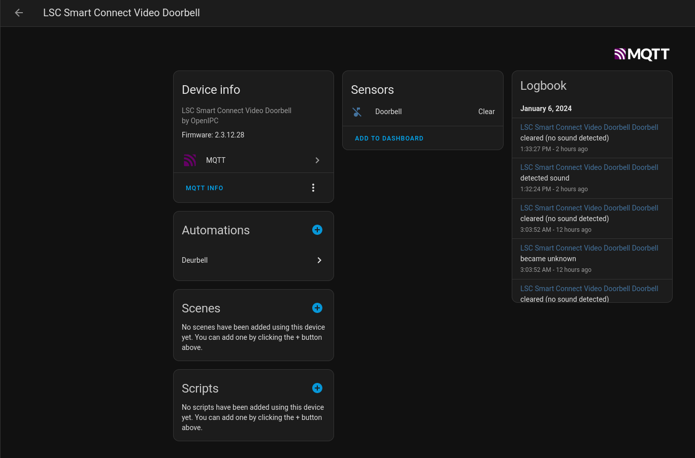

# LSC Smart Connect Video Doorbell (2021) MQTT (WIP)


## Project description

This repository contains a MQTT Client specifically written for the LSC Smart Connect Video Doorbell (2021) and written in Go.

The application uses the Paho MQTT client to connect to an MQTT broker and publish messages about the doorbell's state. It also listens for messages from the broker to update the doorbell's state.

The doorbell's state is represented as a binary sensor in Home Assistant. The application publishes a discovery message to Home Assistant to create the binary sensor.

## Prerequisites

The camera firmware needs to run [OpenIPC](https://openipc.org) firmware. Detailed installation instructions can be found on the OpenIPC website.

LSC regularly introduces new versions of their products with updated hardware. If your camera looks like the one pictured on the box and has a `hi3518ev300` SOC, you're good to go.

For a step-by-step installation guide, please visit: OpenIPC Installation Guide: https://openipc.org/cameras/vendors/hisilicon/socs/hi3518ev300.

For additional information, refer to the following OpenIPC Wiki at: https://github.com/OpenIPC/wiki/blob/master/en/device-lsc-smart-connect-video-doorbell-2021.md.

## How to Run

1. Install Go on your machine if you haven't done so already.
2. Clone this repository.
3. Navigate to the project directory.
4. Create an environment variable: `TOOLCHAIN_BIN_DIR = "/path_to/firmware/output/host/bin"`.
    * *Note:* Retrieve the toolchain from: `https://github.com/OpenIPC/firmware.git`.
5. Run `make` to compile the application.
6. Copy `output/lscdoorbellmqtt` directory to the sdcard of the doorbell.
7. Copy service file: `init.d/S80lscdoorbellmqtt` to `/etc/init.d/` of the doorbell
8. Start the script as a `post-up` option in `/etc/network/interfaces.d/wlan0`.
    ```
    post-up /etc/init.d/S80lscdoorbellmqtt start
    ```
9. Reboot the doorbell and test it out using the doorbell button.
10. ???.
11. Profit.

## Configuration

The application's configuration is stored in a file named `config.yaml`. This file contains the following settings:

- `mqtt_broker`: The hostname or IP address of the MQTT broker.
- `mqtt_port`: The port number of the MQTT broker.
- `mqtt_client_id`: The client ID to use when connecting to the MQTT broker.
- `mqtt_username`: The username to use when connecting to the MQTT broker.
- `mqtt_password`: The password to use when connecting to the MQTT broker.

## Code Structure

The application's code is divided into three packages:

- **main**: This package contains the application's entry point. It initializes the configuration and GPIO handler and starts the MQTT client.
- **mqtt**: This package contains the MQTT client and related functions. It handles connecting to the MQTT broker, subscribing to topics, publishing messages, and discovering Home Assistant.
- **gpiohandler**: This package handles the GPIO operations for the doorbell.

## Dependencies

- [Paho MQTT client for Go](https://github.com/eclipse/paho.mqtt.golang)
- [YAML config generator](https://github.com/spf13/viper)

## Screenshot



## Demo Video (Youtube)

[](https://www.youtube.com/watch?v=OjJcdlTrQ2Q)

## Todo:

* Add camera stream from OpenIPC.

## Contributing

Contributions are welcome! Please feel free to submit a pull request.

## License

This software is released under the [BOLA License](LICENSE).

## Sources

1. https://github.com/OpenIPC/wiki/blob/master/en/installation.md
2. https://github.com/OpenIPC/wiki/blob/master/en/device-lsc-smart-connect-video-doorbell-2021.md
3. https://github.com/ErikMcClure/bad-licenses/blob/master/BOLA-License
